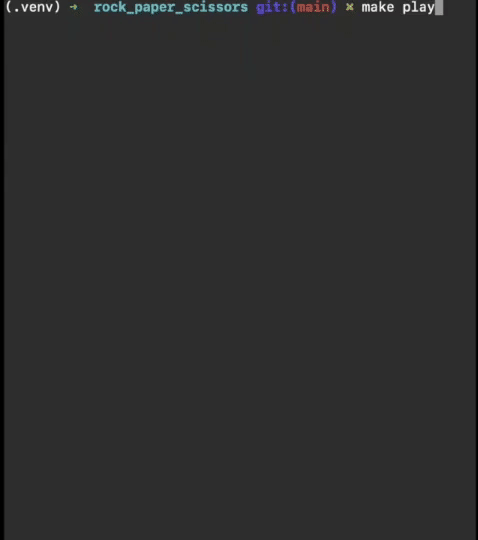

# Rock Paper Scissor war game

[](https://github.com/eclectic-boy/rock_paper_scissors/actions/workflows/ci.yml)

During the festive holidays 2022 I was scrolling on Insta and I bumped into [this reel](https://www.instagram.com/reel/CmK8aKQDvTm/?igshid=YmMyMTA2M2Y=) showing a Rock Paper Scissor war game.

Interesting :eyes:!

It definitely tickled my engineering mind and I thought I could try to do some reverse engineering and try to recreate the whole game with Python :snake: Here is my attempt!



## Basic Rules

- The game takes places on a table which is a matrix;
- We have three types of gestures called suits, these are Rock, Paper and Scissor;
- We have the same number of Rock, Paper and Scissor gestures on the table and each one occupies a cell which can only be occupied by one gesture;
- The game unfolds in rounds;
- For each round, each gesture collects all the available adjacent cells and randomly chooses one. A cell is deemed available if it is either empty or the contained gesture is different from the incoming one;
   - If no available cell is found, the incoming gesture does not move;
   - If an available cell is found, a challenge takes place: the present and incoming gestures are compared and the beaten one is transformed into the winning one.
- Geometrically speaking, there is the possibility that the game will never end (e.g. if different gestures never meet). Nevertheless, we hope to see, after a number of rounds, only one gesture suit present on the table and that would signify the end of the game and would crown that remaining suit as the winner.

## Quick Start

Make sure you have Python3 on your machine.

Clone the repo and change to the root of the project:
```bash
git clone git@github.com:eclectic-boy/rock_paper_scissors.git
cd rock_paper_scissors
```

Create a Python 3 virtual environment and activate it:
```bash
python -m virtualenv .venv -p python3.11
source .venv/bin/activate
```

Start the game
```bash
make play
```

## Tests

In order to run the tests you need to install the requirements:
```bash
pip install -r requirements.txt
```

And you can run the tests:
```bash
make test
```

## Contribution

If you wanted to contribute, please install the requirements first:
```bash
pip install -r requirements.txt
```

And also the pre-commit hooks which will help you polish the code:
```bash
pre-commit install
```
